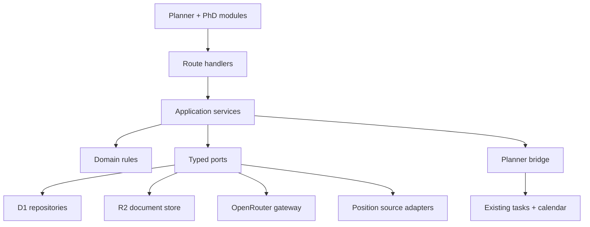

# Research & PhD Application OS — architecture and roadmap

## 1. Current-system audit

The existing application is a compact Persian-first planner running as one Vinext/React application on a Cloudflare Worker.

| Area | Current implementation | Extension consequence |
| --- | --- | --- |
| UI | `app/planner-app.tsx` owns the planner dashboard, calendar, task CRUD, settings and assistant panel | Keep it stable. Add major domains as independent routes and link them through navigation. |
| API | Next App Router handlers under `app/api/**` | Add new APIs by bounded context (`app/api/phd/**`) instead of extending task handlers with PhD-specific branches. |
| Persistence | Cloudflare D1, raw prepared statements, Drizzle schema/migrations | Reuse D1 for relational workflow state. Use R2 only when document bytes are introduced. |
| Planner | `tasks` is the source of truth for calendar and daily work | PhD actions create normal tasks; `planner_links` records ownership and idempotency without changing existing task behavior. |
| AI | OpenRouter Chat Completions with a selectable model and encrypted key | Preserve OpenRouter. Introduce provider/agent ports before adding high-volume analysis jobs. |
| Assistant | Task context is assembled inside `/api/agent` | Add a read-only PhD context loader; do not duplicate a second general assistant. |
| Identity | D1 users, PBKDF2 passwords and hashed database sessions | Every task, profile, credential, agent proposal and PhD record is owner-scoped; future OAuth accounts attach to the same user boundary. |
| Deployment | Vinext/Vite emits a Cloudflare Worker; D1 is declared in `.openai/hosting.json` | New server code must remain Web API-compatible and avoid Node-only libraries. |

### Important constraints discovered

- The current UI is intentionally compact but `PlannerApp` is a large client component. It should be decomposed gradually, not rewritten during PhD module work.
- Runtime table creation and checked-in Drizzle migrations both exist. New tables follow both paths for compatibility; a later hardening milestone should make migrations the sole production authority.
- The supplied Python scraper contains useful source mappings and workflow ideas, but its Playwright/browser fallback, Pandas/Google Sheets output, local paths and terminal UI cannot run inside a Cloudflare Worker.
- The supplied scraper also contained an embedded OpenRouter credential and personal CV content. Neither was copied into the application. The exposed credential must be rotated before any reuse of that script.
- LinkedIn should not be scraped with browser-evasion logic. Use an official integration when available, or accept user-supplied links/imports.

## 2. Target architecture



The dependency direction is inward: UI and infrastructure depend on application/domain contracts. Domain rules never import Cloudflare, React, OpenRouter or a source-specific scraper.

### Recommended module shape

```text
modules/
  phd/
    domain/              entities, value objects, scoring rules
    application/         use cases and agent commands
    infrastructure/      D1, source and external-service adapters
    server/              Worker-safe composition/repositories
  ai/
    domain/              provider-neutral prompts and structured outputs
    application/         coordinator and specialized agent contracts
    infrastructure/      OpenRouter gateway, queues, telemetry
app/
  phd/                   presentation only
  api/phd/               HTTP transport only
```

### Core contracts

- `PositionDiscoveryPort.discover(query)` returns normalized raw opportunities and source provenance.
- `MatchScoringPort.score(profile, position)` returns the four component scores, overall score, evidence, gaps and model metadata.
- `DocumentStorePort` owns versioned bytes in R2 while D1 stores metadata and usage history.
- `PlannerPort.schedule(command)` is idempotent and always creates a normal planner task.
- `MailPort.createDraft`, `preview`, `approve` and `sendApproved` enforce the no-auto-send rule at the application layer.
- `AgentPort.execute(command, context)` returns a proposed result; agents cannot directly send email or mutate a workflow requiring approval.

## 3. Multi-agent operating model

The coordinator assigns bounded commands; specialized agents do not call one another directly.

| Agent | Reads | Produces | May cause an external side effect? |
| --- | --- | --- | --- |
| Coordinator | User intent, application state, policies | Ordered commands and consolidated answer | No |
| Search | Source catalog, search profile | Normalized position candidates | No |
| Professor | Professor/lab/publication records | Research-overlap report | No |
| Paper | Paper text/metadata | Summary, gaps, future work | No |
| CV / SOP / Proposal | Candidate profile, position context, version history | Versioned document draft | No |
| Email | Approved context and document references | Draft plus quality scores | No |
| Inbox | Authorized thread metadata | Reply classification and suggested reply | No |
| Reminder / Planner | Deadlines and next actions | Idempotent planner commands | Only internal task creation |
| CRM | Approved workflow commands | Application status/timeline events | Internal state only |
| Analytics | Immutable events | Aggregated metrics | No |

Email sending is a separate application command requiring an approved draft version. An agent response alone can never authorize sending.

## 4. Data ownership

Milestone 1 adds these D1 tables (all owner-scoped):

- `phd_profiles`
- `phd_positions`
- `position_matches`
- `phd_applications`
- `phd_timeline_events`
- `planner_links`
- `agent_action_proposals`
- `agent_action_events`

`planner_links` is the anti-corruption layer between the new bounded context and the existing planner. It stores `(entity_type, entity_id, action_type) → task_id`, so retries do not create duplicate calendar tasks.

Future document bytes belong in R2. D1 stores document metadata, version number, checksum, owner, source application and sent/approved references.

## 5. Position-ingestion design derived from the supplied scraper

Reusable concepts:

- asynchronous source discovery;
- a per-source configuration/adapter;
- normalized `title`, `country`, `published/deadline` and `url` fields;
- country, keyword and recency filtering;
- a second pass for position details;
- structured requirement extraction and explainable match scoring.

Cloudflare replacement:

1. A Cron Trigger writes one `discover_positions` job per enabled source/query.
2. Queue consumers call a source adapter with strict timeouts, rate limits and source policy metadata.
3. The normalizer computes a canonical fingerprint and upserts into D1.
4. Detail extraction runs only for new/changed records.
5. AI scoring runs after deterministic eligibility filters and stores prompt/model/version metadata.
6. Failures are source-scoped; one blocked source never blocks the whole discovery run.

Headed browsers, CAPTCHA bypasses and persistent Chrome profiles are deliberately excluded.

## 6. Milestone roadmap

| Milestone | Deliverable | Acceptance gate |
| --- | --- | --- |
| 0 — Security and seams | Rotate the exposed scraper key; establish structured logging, provider/agent interfaces and migration policy | No secret in source; existing planner regression suite green |
| 1 — Journey foundation | PhD command center, D1 domain tables, explainable baseline score, application shortlist and planner bridge | Implemented in this version; task created once and visible in planner |
| 2 — Position Finder ingestion | Worker-safe adapters for FindAPhD, EURAXESS and Academic Positions; Australian university adapter registry; scheduled sync and source health | Repeated sync is idempotent; provenance and last-seen timestamps visible |
| 3 — Candidate profile and documents | CV/SOP versions, R2 storage, tailoring workflow, sent-version tracking, AI match scoring | Every generated artifact has immutable source/version references |
| 4 — Professor and paper intelligence | Professor workspace, publication ingestion, paper summaries, gaps and proposal builder | Every claim links to a source paper/URL and timestamp |
| 5 — Email approval and integrations | Draft → preview → edit → approve → send; Gmail and Outlook adapters; thread/status storage | Sending is impossible without a current approved draft |
| 6 — Inbox, interview and outcome workflows | Reply classifier, suggested replies, interview preparation, scholarship tracker, offer/visa checklist | Suggestions never auto-send; all deadlines create planner actions |
| 7 — Analytics and memory | Funnel analytics, response time, event ledger, scoped AI memory, retrieval/vector layer | Memory is owner-scoped, inspectable and deletable |
| 8 — Expansion | References, publication/conference tracking, Scholar/ORCID/arXiv, notebook/knowledge graph, MCP, voice/mobile | Each addition implements a port without changing existing domains |

## 7. What Milestone 1 implements

- A new `/phd` route; the original planner route remains unchanged.
- A polished command center for research, English, documents and relocation.
- Filterable positions with transparent four-part match scoring.
- Shortlisting into the application CRM and a timeline event.
- Idempotent scheduling into the existing calendar/task model.
- Read-only PhD context for the existing AI assistant.
- An operational task agent with preview, approval, audit history and conflict-aware undo.
- Multi-user signup/sign-in, secure sessions and isolated credentials/data.
- Manual position intake with Jalali deadline entry and immediate explainable scoring.
- Source contracts derived from the supplied scraper for FindAPhD, EURAXESS and Academic Positions.
- Clearly labeled demonstration positions, so the UI can be evaluated before live ingestion is introduced.

Not yet implemented: live scraping, document generation/storage, professor/paper retrieval, email OAuth/sending, inbox analysis, visa data, RAG/vector search or autonomous background agents. Those remain deliberately behind later milestones.
